### Introduction

This document is a black-box testing guide for dorafactory multisig frontend mvp milestone-1, which demonstrates a complete flow of using multisig. 

### Prerequisites
1. Chrome web browser required, make sure it support locaStorage
2. Install polkadot js extension for your browser https://polkadot.js.org/extension/
3. Use the extension to create a least 3 new account and allow to use on any chain
4. If you want to run whole test on you local machine, you can set up a local dev chain. We recommend [polkadot-v0.9.17 version](https://github.com/paritytech/polkadot/tree/release-v0.9.17)

### Test
1. (Optional) If it inconvenient for you to use polkadot/kusama chain to test, you can build up a polkadot chain. Build the bin file following official guide. Then run following command.
```
./target/release/polkadot --dev
````
2. Start up our application and open a browser navigate to `http://localhost:3000`, and select local chain, then click the create wallet button
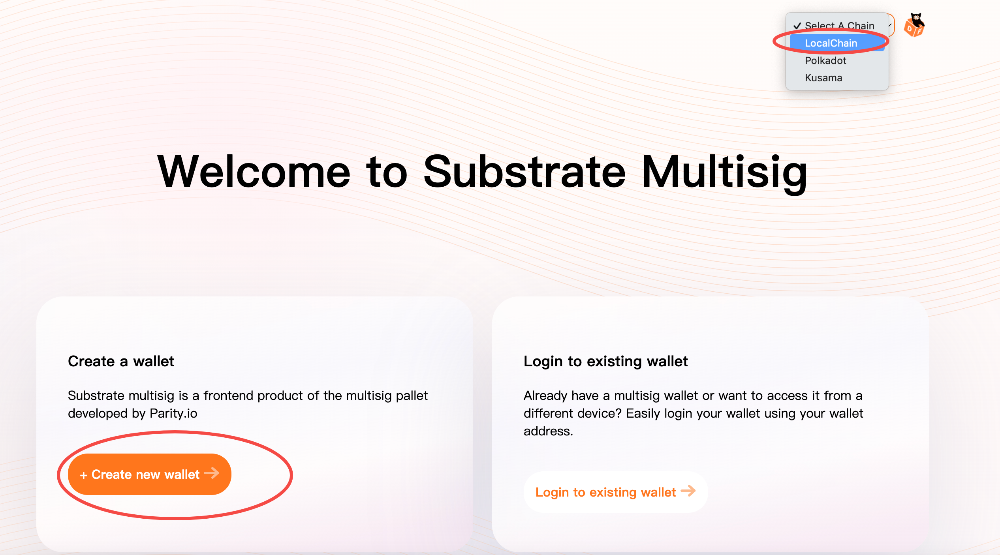
3. On the next coming steps, please allow our application to connect polkadot js extensions, then select the primary account to create a mulstisig wallet. Suppose you'll get a summary like below
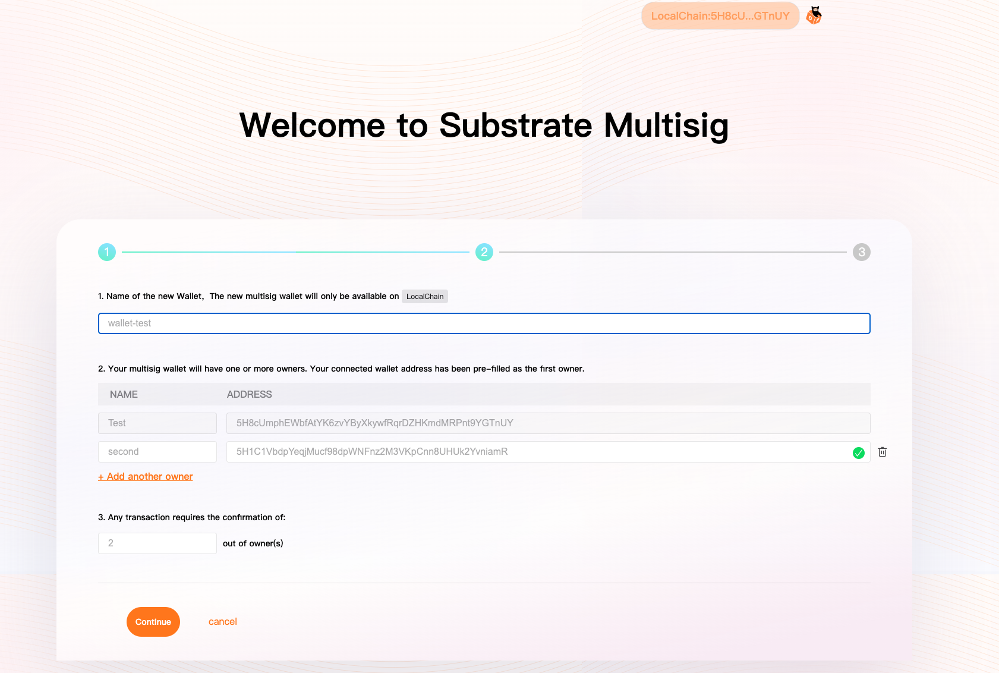
4. At the final step of a wallet creation, please double confirm your wallet addresses are filled correctly.
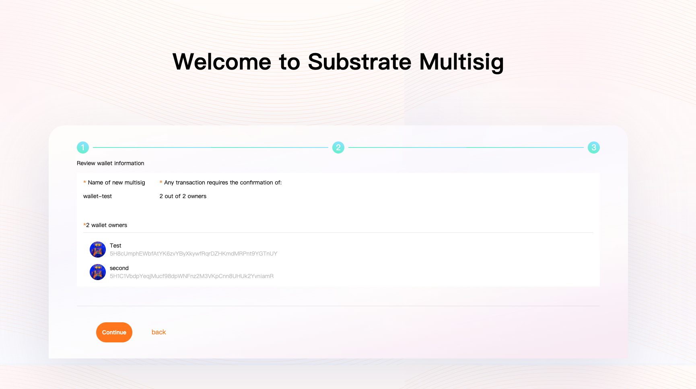
5. Here suppose you can see the asset management page, we can use [polkadot js](https://polkadot.js.org/apps/#/accounts) to make a cross verification. 
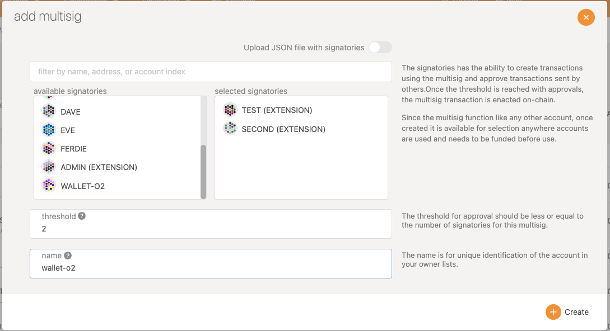
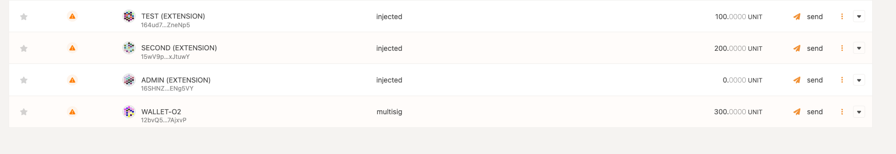
You can compare the address generated by polkadot js app and our own. They are the same.
```
Notice
In order to test our coming extrinsics, we transfer 100 unit to one member of our multisig account and 200 unit to other. And transfer 300 units to the multisig account in advance. You need to desposit some units in advance as well.
```
6. Let's switch back to our own application, you'll see the latest balance 
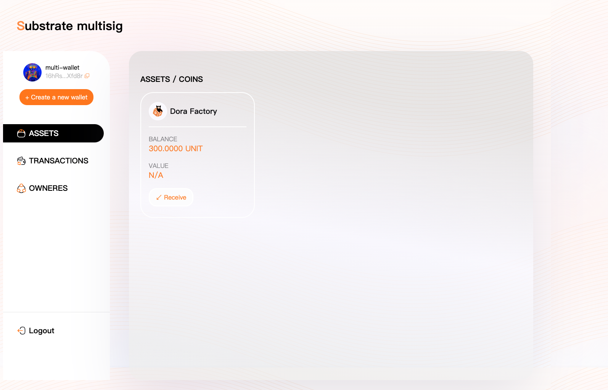
7. You can click other items on left side menu, the owners are same with our creation. Also you may find that transactions is empty now.
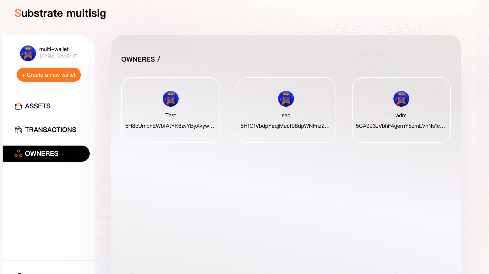
8. We use the `New Transaction` button to initiate a transaction and then switch to another approve it.
 - We use test account to initiate a transaction of transferring 10 units to himself.
 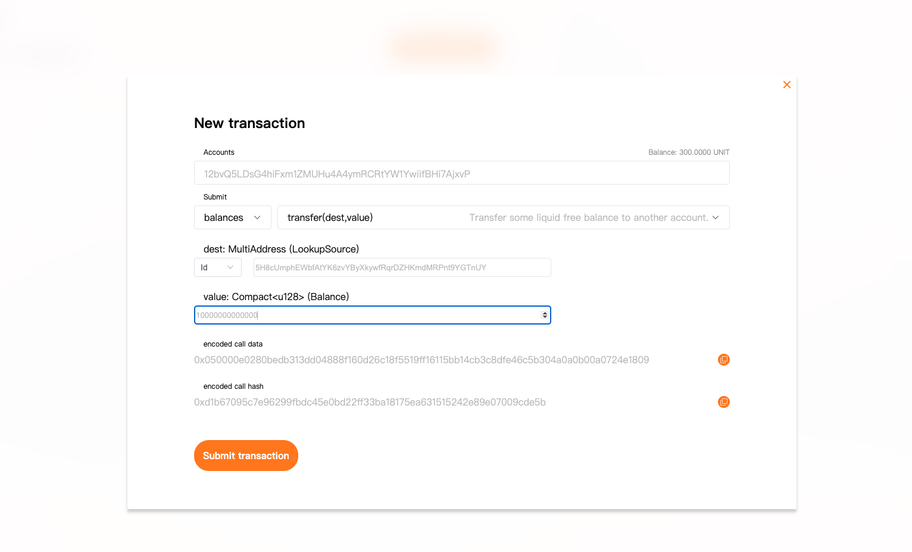
then you can see the transaction details in created tab.(If not please switch to other menu and back, it'll reload)
 
- Click the `Create a new wallet` to use the other account to create same wallet with different owner.
 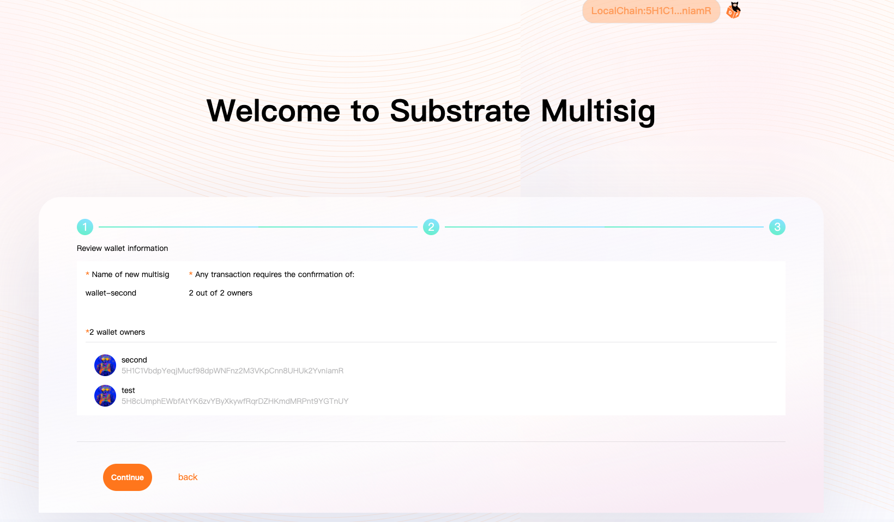
 then you'll find the transaction just created in last step in your pending tab.
 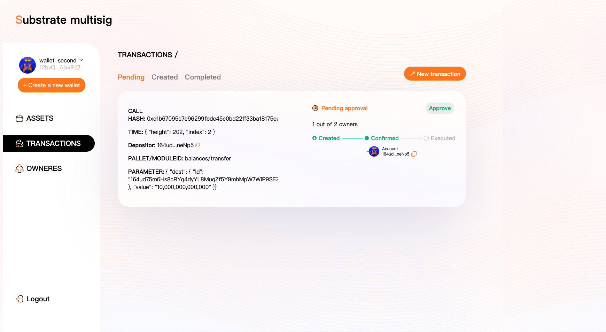
- Approve this transaction, wait for the extrinsic to complete, then go back to assets menu, you'll the balance changed as expected
 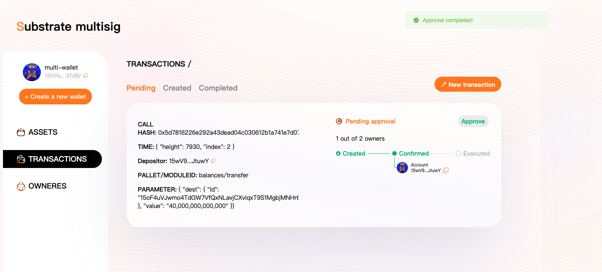
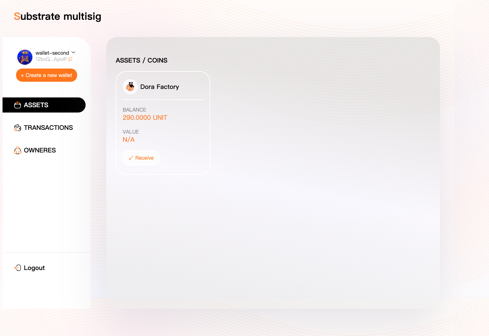

9. At last, you can create more multisig transactions like above. Use one account to create and the other to approve.
 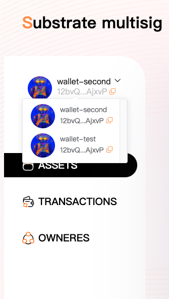

