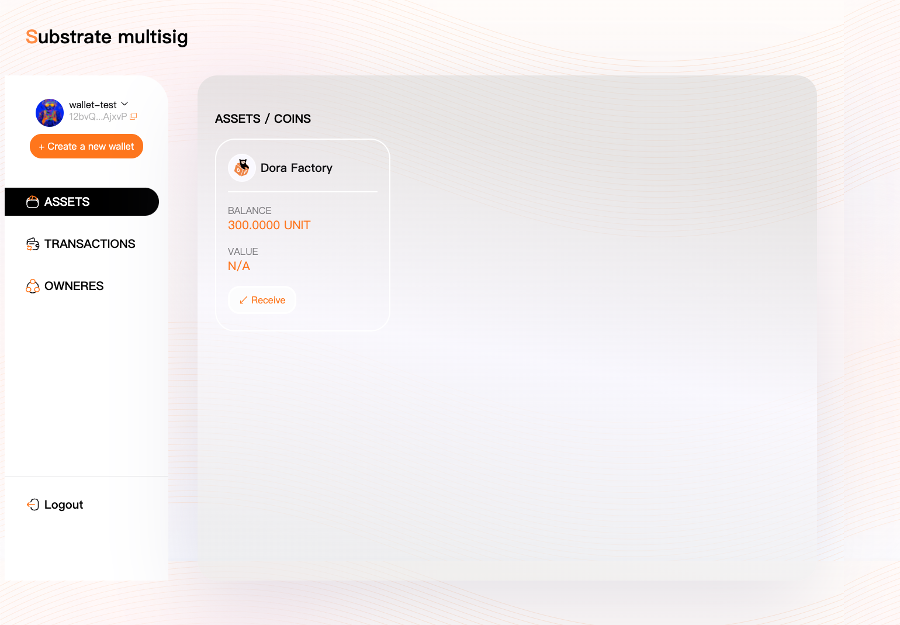
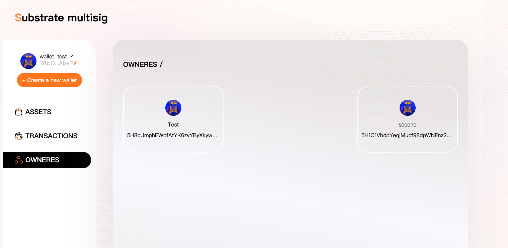
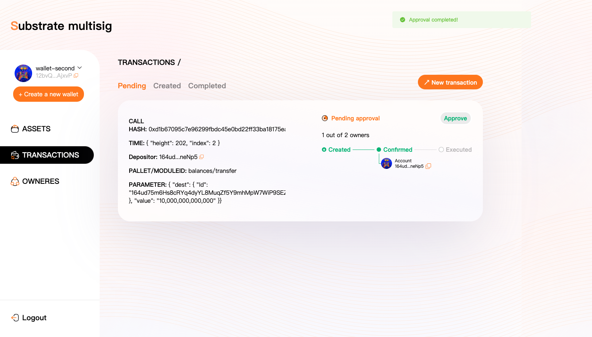

### Introduction

This document is a black-box testing guide for dorafactory multisig frontend mvp milestone-1, which demonstrates a complete flow of using multisig. 

### Prerequisites
1. Chrome web browser required
2. Install polkadot js extension for your browser https://polkadot.js.org/extension/
3. Use the extension to create a least 3 new account and allow to use on any chain
4. If you want to run whole test on you local machine, you can set up a local dev chain. We recommend [polkadot-v0.9.17 version](https://github.com/paritytech/polkadot/tree/release-v0.9.17)

### Test
1. (Optional) If it inconvenient for you to use polkadot/kusama chain to test, you can build up a polkadot chain. Build the bin file following official guide. Then run following command.
```
./target/release/polkadot --dev
````
2. Start up our application and open a browser navigate to `http://localhost:3000`, and select local chain, then click the create wallet button

3. On the next coming steps, please allow our application to connect polkadot js extensions, then select the primary account to create a mulstisig wallet. Suppose you'll get a summary like below

4. At the final step of a wallet creation, please double confirm your wallet addresses are filled correctly.

5. Here suppose you can see the asset management page, we can use [polkadot js](https://polkadot.js.org/apps/#/accounts) to make a cross verification. 


You can compare the address generated by polkadot js app and our own. They are the same.
```
Notice
In order to test our coming extrinsics, we transfer 100 unit to members of our multisig account and 300 unit to the multisig account in advance. You need to desposit some units in advance as well.
```
6. Let's switch back to our own application, you'll see the latest balance 

7. You can click other items on left side menu, the owners are same with our creation. Also you may find that transactions is empty now.

8. We use our multisig account to transfer some units back to Alice account.
 - We get the call data following these steps, create 3 transfer extrinsics with amount 30, 40 and 50.
 
- Create 3 multisig extrinsics using different accounts separately
 
 
9. After all these setup, we can see pending and created transactions. We use `Test` account as our primary account, so we can see only other 2 in pending.
 
10. As current pallet can only reject his own multisig extrinsics, so we just provide 1 option here. You can approve if you want.
 
11. After all approval, 90 units have been transferred to Alice, you can go back to asset index to check

